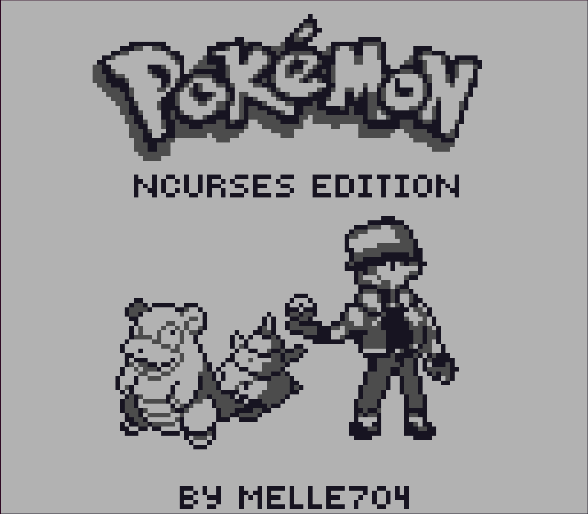
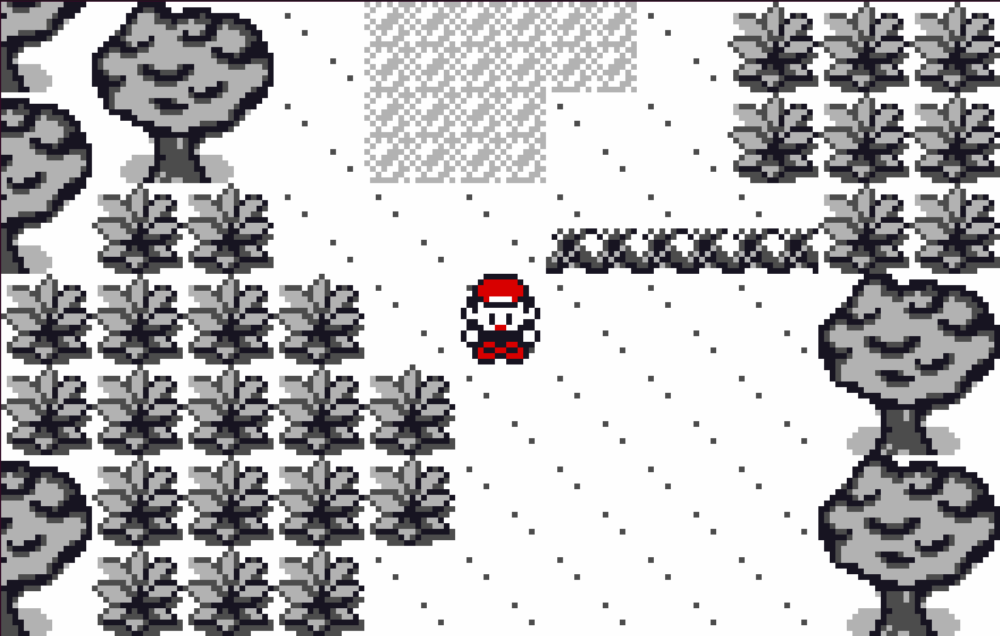
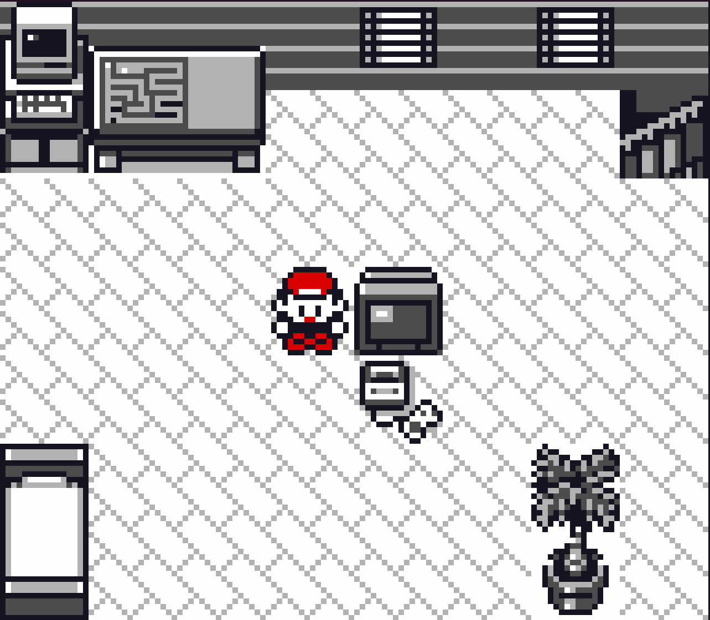
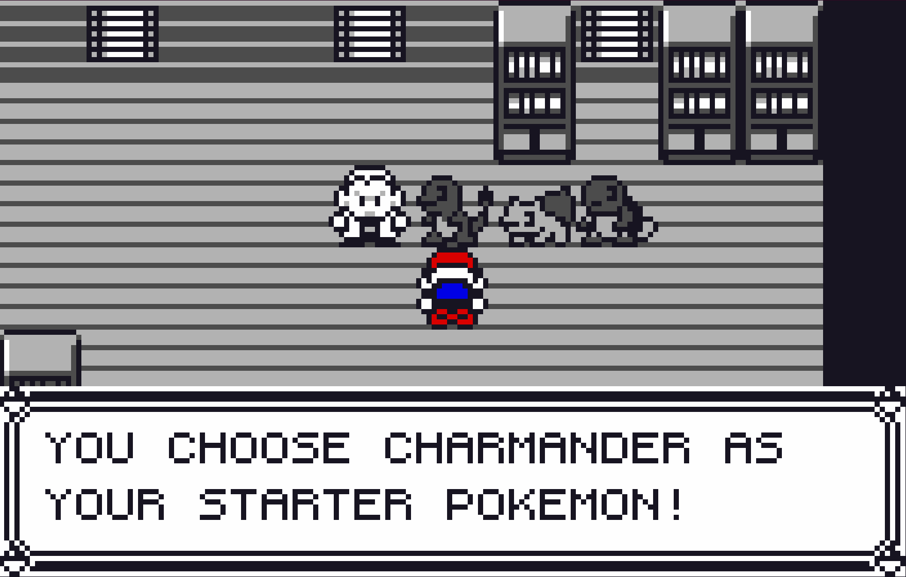
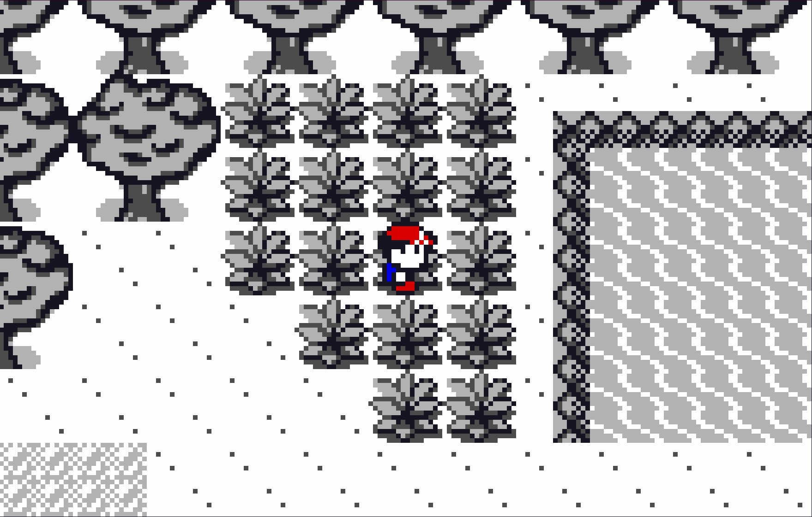
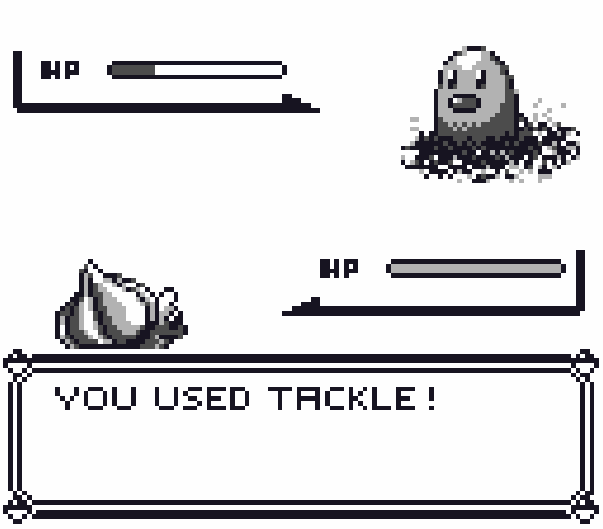
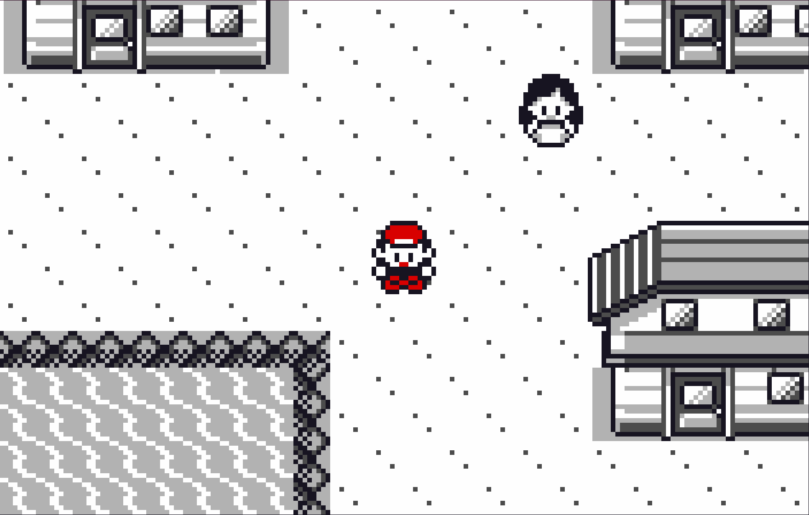

# Pokemon Ncurses
A simple terminal-based Pokemon-inspired demo game, written in pure C with the `Ncurses` library for rendering.

  
  

Developed as the final assignment for the introductory C programming course at the University of Amsterdam.

* Chosen as the top pick by Teaching Assistants and ranked as the second favorite among the students.

## How to Run
It is recommended to use the 'square.ttf' font included in the repo for better graphical quality. Without the font, the game will look narrow and squished.

### Linux
1. Clone / download the repository
2. Open a terminal
3. Resize terminal to be at least 176x112 characters
4. Run `./pokemon_ncurses.sh`

### Dependencies
This project relies on the standard C library along with the `Ncurses` library.

## How to Play
You can move around using the WASD and arrow keys and interact with objects and people using the enter key.

## Preview

